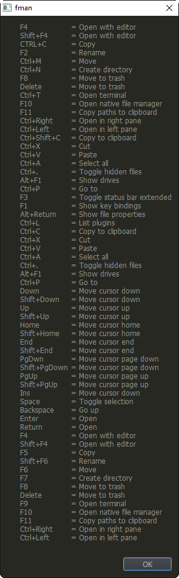

# ShowKeyBindings

Plugin for [fman.io](https://fman.io) to list all active keybindings.  

Install by uploading "ShowKeyBindings" to your [data directory](https://fman.io/docs/customizing-fman)`/Plugins/user` or use the Plugin manager in fman.

**Usage**

Press **F1**

**Screenshot**

