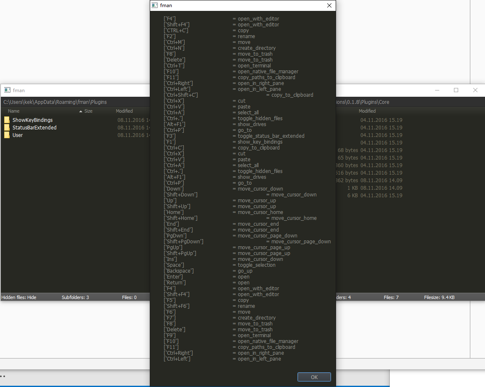

# ShowKeyBindings

Plugin for [fman.io](https://fman.io) to quickly see all available keybindings.  

Install by uploading "ShowKeyBindings" to your [data directory](https://fman.io/docs/customizing-fman)`/Plugins`.

**Usage**

Press **F1**

**Screenshot**

**Old screenshot**

